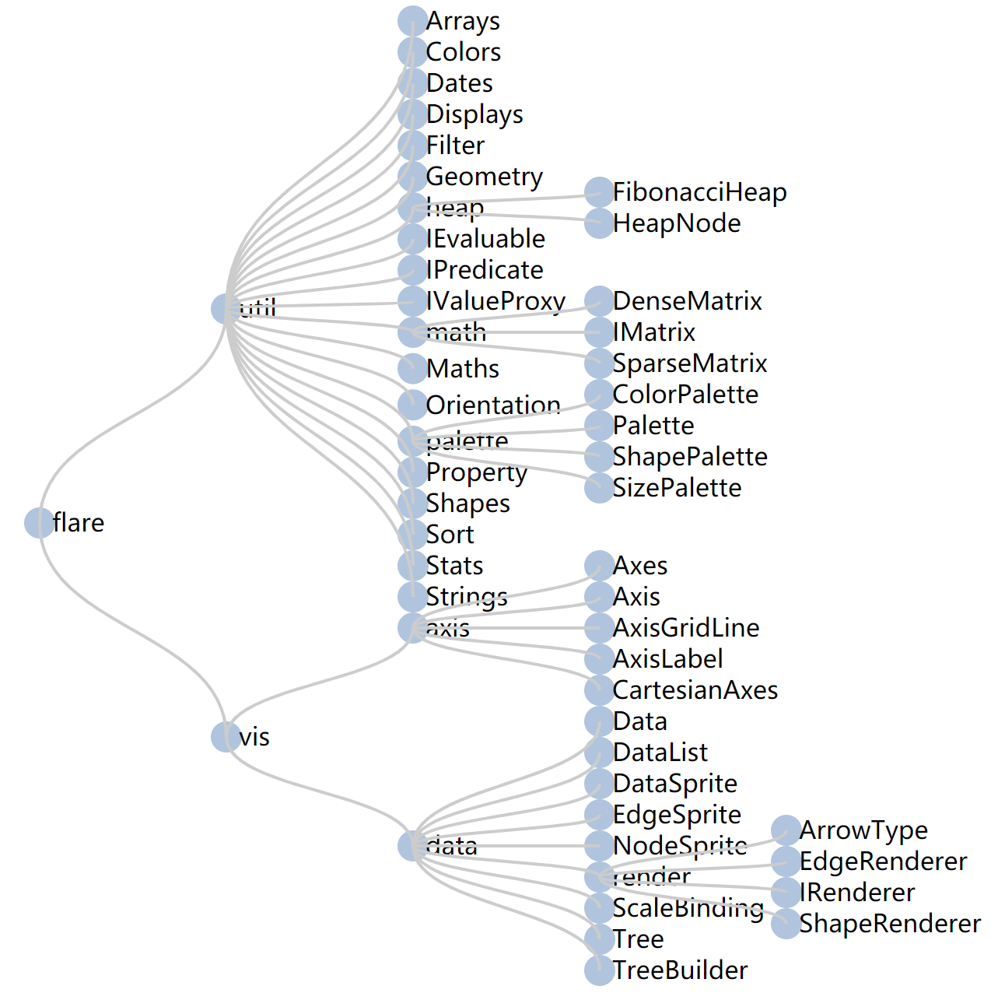
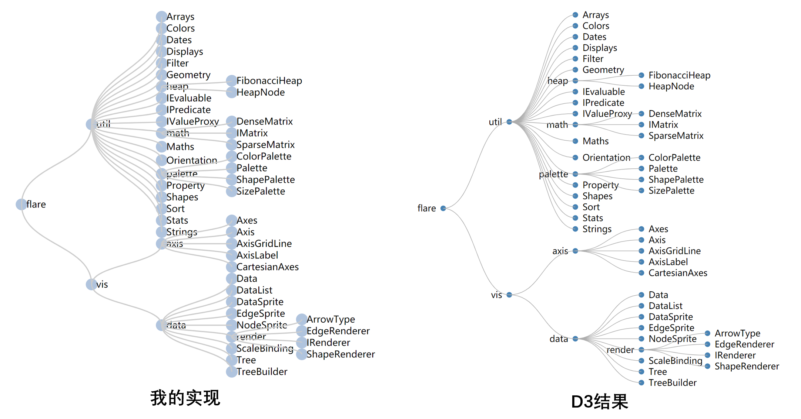

# Node-link Tree 

## 一、效果展示

### 1.1 展示树布局



### 1.2 点击展开和隐藏

鼠标点击树的结点。若结点可展开，则颜色为深蓝色；否则为浅蓝色。效果详见视频。


## 二、基本原理

参考Buchheim等人的论文*Improving Walker’s algorithm to run in linear time*。

该方法对整棵树进行两次遍历，一次自底向上，一次自顶向下。在一遇到子树之间重叠的情况时就调整子树的位置，并通过添加多种辅助变量的方式将时间复杂度降为*O(n)*。


## 三、实现细节

### 3.1 构建树

首先根据json数据，使用广度优先探索构建树。

```javascript
function treeify (data) {
  let root = new TreeNode(data)
  let currNode, nodeQueue = [root]

  // BFS
  while (currNode = nodeQueue.pop()) {
    let childList = (currNode.data.children)
    childList = (childList) ? Array.from(childList) : []
    let n = childList.length
    for (let i = 0; i < n; i++) {
      childList[i] = new TreeNode(childList[i])
      let currChild = childList[i]
      nodeQueue.push(currChild)
      currChild.parent = currNode
      currChild.depth = currNode.depth + 1
    }
    currNode.children = childList
  }

  return root
}
```


### 3.2 布局树的结点

然后算法计算树中每个结点的位置。

```javascript
function TreeLayout (root, x, y, dx, dy) {
  // 初始化结点
  InitNodes(root)

  FirstWalk(root)
  // 根据mod值计算最终的x值
  SecondWalk(root, -root.prelim)
  // 根据大小对树进行放缩
  ScaleTree(root, x, y, dx, dy)

  return root
}
```

#### 3.2.1 第一步：初始化结点

第一步是初始化结点中的各项数据。

```javascript
function InitNodes (root) {
  // BFS
  let currNode, nodeQueue = [root]
  while (currNode = nodeQueue.pop()) {
    currNode.ancestor = currNode
    currNode.prelim = 0
    currNode.mod = 0
    currNode.change = 0
    currNode.shift = 0
    currNode.thread = null

    let n = currNode.children.length
    for (let i = 0; i < n; i++) {
      let child = currNode.children[i]
      child.parent = currNode
      child.number = i
      nodeQueue.push(child)
    }
  }
}
```


#### 3.2.2 第二步：自底向上遍历

第二步是自底向上遍历这棵树，计算结点x、y坐标的初步值。在计算当前结点``v``的初步值之前，该函数会递归计算所有子结点的情况。然后执行函数``ExecuteShifts``，让子结点相互隔开。之后将当前结点``v``的位置置于所有子结点的中间位置。

在这一步中要注意当``v``为叶节点时候的情况。

```javascript
function FirstWalk (v) {
  let w = GetPrevSibling(v)
  if (IsLeaf(v)) {
    if (w === null) v.prelim = 0
    else v.prelim = w.prelim + distance
  } else {
    let defaultAncestor = GetLeftmostChild(v)
    for (let i = 0; i < v.children.length; i++) {
      let w = v.children[i]
      FirstWalk(w)
      defaultAncestor = Apportion(w, defaultAncestor)
    }
    ExecuteShifts(v)
    let midpoint = (GetLeftmostChild(v).prelim + GetRightmostChild(v).prelim) / 2
    if (w !== null) {
      v.prelim = w.prelim + distance
      v.mod = v.prelim - midpoint
    } else {
      v.prelim = midpoint
    }
  }
}
```

其中，``Apportion``函数从当前结点``v``和``v``的左兄弟结点出发，往叶节点方向遍历，根据子树的轮廓，判断它们所在的子树之间是否有重叠。

若``shift > 0``，则说明两棵子树发生了重叠，需要移动。此时``Apportion``函数就会调用``MoveSubtree``函数调整子树的位置。

```javascript
function Apportion (v, defaultAncestor) {
  let w = GetPrevSibling(v)
  if (w !== null) {
    let vip = v, vop = v
    let vin = w, von = GetLeftmostSibling(vip)
    let sip = vip.mod, sop = vop.mod
    let sin = vin.mod, son = von.mod
    while (NextRight(vin) !== null && NextLeft(vip) !== null) {
      vin = NextRight(vin)
      vip = NextLeft(vip)
      von = NextLeft(von)
      vop = NextRight(vop)
      vop.ancestor = v
      let shift = (vin.prelim + sin) - (vip.prelim + sip) + distance
      if (shift > 0) {
        MoveSubtree(Ancestor(vin, v, defaultAncestor), v, shift)
        sip += shift
        sop += shift
      }
      sin += vin.mod
      sip += vip.mod
      son += von.mod
      sop += vop.mod
    }

    if (NextRight(vin) !== null && NextRight(vop) === null) {
      vop.thread = NextRight(vin)
      vop.mod += sin - sop
    }

    if (NextLeft(vip) !== null && NextLeft(von) === null) {
      von.thread = NextLeft(vip)
      von.mod += sip - son
      defaultAncestor = v
    }
  }
  return defaultAncestor
}
```


#### 3.2.3 第三步：自顶向下遍历

第三步是自顶向下遍历这棵树，计算结点的x、y坐标的确切值。

```javascript
function SecondWalk (v, m) {
  v.x = v.prelim + m
  v.y = v.depth
  for (let i = 0; i < v.children.length; i++) {
    let w = v.children[i]
    SecondWalk(w, m + v.mod)
  }
}
```


#### 3.2.4 第四步：放缩

第三步得到的x、y坐标都是单位坐标，需要将其放缩到给定的大小。

```javascript
function ScaleTree (root, dx, dy) {
  let nodes = listify(root)
  nodes.forEach((node) => {
    node.x *= dx
    node.y = node.depth * dy
  })
}
```


### 3.3 实现点击展开和隐藏

当结点被点击时，程序会将其子节点数组放到另一个变量中，然后清空子节点数组。由于程序是根据结点的``children``变量判断是否具有子节点，所以在重新布局时，该结点就会被视为叶结点。通过这种方式实现展开和隐藏功能。

````javascript
function click (event, d) {
  if (!d._children) {
    if (d.children.length > 0) {
      d._children = d.children
      d.children = []
    }
  } else {
    d.children = d._children
    d._children = null
  }
  update(dataRoot)
}
````


### 3.4 边的绘制

根据当前结点和父节点的x、y坐标，使用D3的``path``进行绘制。

````javascript
const diagonal = (p, n) => {
  return 'M' + n.y + ',' + n.x
    + 'C' + n.y + ',' + (n.x + p.x) / 2
    + ' ' + p.y + ',' + (n.x + p.x) / 2
    + ' ' + p.y + ',' + p.x
}
````

```javascript
let linkEnter = link.enter()
	.append('path')
	.attr('d', d => {
	    return d.parent ? diagonal(d.parent, d) : ''
	})
```


## 四、结果分析与讨论

该实现的布局效果与D3在结点位置上的结果较为接近。



但在实现结果中，中间结点和其左右兄弟结点之间的距离比D3结果更近，这使得实现结果不如D3结果美观。
