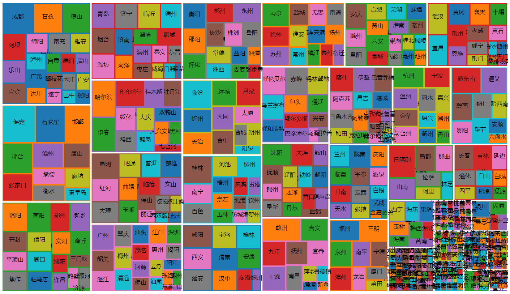
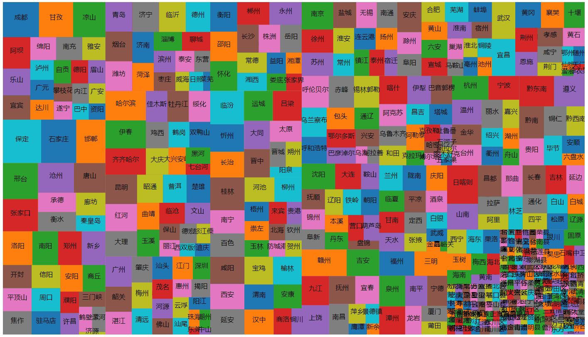

# Treemap实现

2020214004 雷诚

## 一、效果展示

### 1.1 nested treemap



### 1.2 Non-nested treemap




## 二、基本原理

参考Bruls等人的论文*Squarified Treemaps*。

该方法先在一个方向（水平/竖直）上摆放矩形，让这些矩形完全占满该方向。当矩形的宽高比不再降低时，变换摆放矩形的方向。重复以上步骤直到所有数据都摆放完毕。


## 三、实现细节

### 3.1 构建树

首先根据json数据，使用广度优先探索构建树。

```javascript
function treeify (data) {
  let root = new TreeNode(data)
  let currNode, nodeQueue = [root]

  // BFS
  while (currNode = nodeQueue.pop()) {
    let childList = GetChildrenFromData(currNode.data)
    if (childList) {
      childList = Array.from(childList)
      let n = childList.length
      for (let i = 0; i < n; i++) {
        childList[i] = new TreeNode(childList[i])
        let currChild = childList[i]
        nodeQueue.push(currChild)
        currChild.parent = currNode
        currChild.depth = currNode.depth + 1
      }
      currNode.children = childList
    }
  }

  initNodeValues(root)

  return root
}
```

由于所用的json数据在不同层使用不同的变量存储其子结点，因此使用``GetChildrenFromData``函数来获得子结点。

```javascript
let GetChildrenFromData = (data) => {
  if (data.citylist) return data.citylist
  else if (data.c) return data.c
  else if (data.a) return data.a
}
```


### 3.2 逐层进行布局

由于要实现non-nested treemap，因此只将每一层中的所有结点看作需要布局的所有数据，子结点只在其父节点所分配的矩形中进行布局。

```javascript
function hierarchicalSquarify (root, x, y, dx, dy, maxDepth, strokeFunc) {
  let currNode, nodeQueue = [root]
  root.x0 = x
  root.y0 = y
  root.dx = dx
  root.dy = dy

  // BFS
  let res = []
  while (currNode = nodeQueue.pop()) {
    if (currNode.children && currNode.depth <= maxDepth) {
      currNode.children = squarify(currNode.children, currNode.x0, currNode.y0, currNode.dx, currNode.dy, strokeFunc)
      let n = currNode.children.length
      for (let i = 0; i < n; i++) {
        nodeQueue.push(currNode.children[i])
        res.push(currNode.children[i])
      }
    }
  }

  return res
}
```


### 3.3 对某一层进行布局

#### 3.3.1 第一步：归一化

所有数据之和必须等于当前给定矩形的面积，因此需要对数据进行归一化。

```javascript
scaleWeights(nodes, dx, dy)
```

```javascript
function scaleWeights (nodes, dx, dy) {
  let scale = dx * dy / sum(nodes, 0, nodes.length)
  for (let i = 0; i < nodes.length; i++) {
    nodes[i].value = scale * nodes[i].value
  }
}
```


#### 3.3.2 第二步：降序排列

降序排列的数据通常能获得最好的结果。

```javascript
nodes.sort((n1, n2) => {
    return n2.value - n1.value
})
```


#### 3.3.3 第三步：布局

变量``isVertical``用来表示当前放置矩形的方向是竖直还是水平。

不断地放置矩形，使用``worst``函数获得当前方向的最大宽高比``currWorst``以及放入当前矩形后最大宽高比``concatWorst``。

```javascript
let currWorst = worst(s, minR, maxR, w) // worst(row, w)
let concatWorst = worst(s + currValue, Math.min(minR, currValue), Math.max(maxR, currValue), w) // worst(row++[c], w)
```

比较``currWorst``和``concatWorst``，如果``currWorst > concatWorst``，说明放入当前矩形能改善结果；反之，说明宽高比不再降低，需要换一个方向。

```javascript
if (end - start === 0 || currWorst > concatWorst) {
    end++ // row++[c]
} else {
    //layoutrow(row)
}
```

重复以上步骤，直到所有数据都完成布局。


## 四、结果分析与讨论

该实验基本实现了squarified treemap布局算法。

但当数据量很大且层次较多时，non-nested treemap就很难获得层次信息；nested treemap虽然可以获得层次信息，但不够清晰。同时，如果数据之间差异较大时，这会导致矩形面积差异较大，使得矩形上的文字需要调整以适应它们的差异。